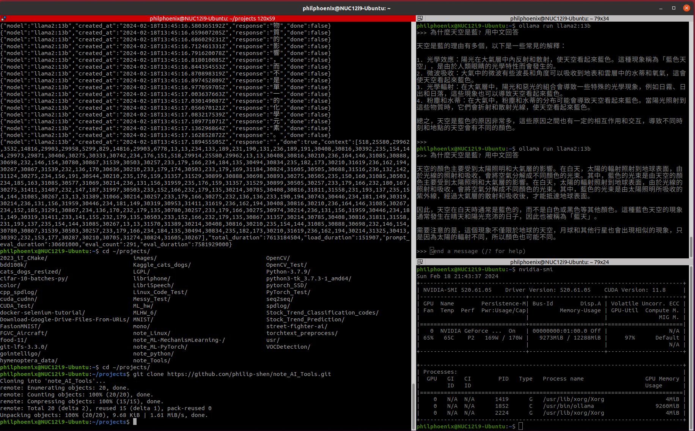

Table of Contents
=================

   * [Table of Contents](#table-of-contents)
   * [Purpose](#purpose)
   * [LLaMa](#llama)
      * [Source Code](#source-code)
      * [Reference](#reference)
   * [Ollama](#ollama)
      * [Environment](#environment)
      * [Source Code](#source-code-1)
      * [Manual Installation Locally](#manual-installation-locally)
         * [Download the ollama binary](#download-the-ollama-binary)
         * [Adding Ollama as a startup service (recommended)](#adding-ollama-as-a-startup-service-recommended)
         * [Install CUDA drivers (optional – for Nvidia GPUs)](#install-cuda-drivers-optional--for-nvidia-gpus)
         * [Start Ollama](#start-ollama)
         * [Example](#example)
      * [Reference](#reference-1)
   * [LM Studio](#lm-studio)
      * [App Link](#app-link)
      * [Reference](#reference-2)
   * [Troubleshooting](#troubleshooting)
   * [Reference](#reference-3)
   * [h1 size](#h1-size)
      * [h2 size](#h2-size)
         * [h3 size](#h3-size)
            * [h4 size](#h4-size)
               * [h5 size](#h5-size)

Created by [gh-md-toc](https://github.com/ekalinin/github-markdown-toc)
 
# Purpose
Take note of LLM (Large Language Model) related stuff

# LLaMa  

## Source Code  
[hiyouga/LLaMA-Factory](https://github.com/hiyouga/LLaMA-Factory)    

## Reference  
[LLaMA-Factory 開源語言模型微調專案　方便微調各種大型語言模型｜內建WebUI　方便使用｜內建多種訓練方式讓使用者選擇](https://the-walking-fish.com/p/llama-factory/)  


# Ollama  

## Environment  
* OS：Ubuntu 20.04 LTS
* CPU：intel core i9 12900
* RAM：32GB
* GPU：NVIDIA GeForce RTX 3060

## Source Code  
[ollama/ollama](https://github.com/ollama/ollama)    

[ollama-webui/ollama-webui](https://github.com/ollama-webui/ollama-webui)    

## Manual Installation Locally 
### Download the `ollama` binary

Ollama is distributed as a self-contained binary. Download it to a directory in your PATH:

```bash
sudo curl -L https://ollama.com/download/ollama-linux-amd64 -o /usr/bin/ollama
sudo chmod +x /usr/bin/ollama
```

### Adding Ollama as a startup service (recommended)

Create a user for Ollama:

```bash
sudo useradd -r -s /bin/false -m -d /usr/share/ollama ollama
```

Create a service file in `/etc/systemd/system/ollama.service`:

```ini
[Unit]
Description=Ollama Service
After=network-online.target

[Service]
ExecStart=/usr/bin/ollama serve
User=ollama
Group=ollama
Restart=always
RestartSec=3

[Install]
WantedBy=default.target
```

Then start the service:

```bash
sudo systemctl daemon-reload
sudo systemctl enable ollama
```

### Install CUDA drivers (optional – for Nvidia GPUs)

[Download and install](https://developer.nvidia.com/cuda-downloads) CUDA.

Verify that the drivers are installed by running the following command, which should print details about your GPU:

```bash
nvidia-smi
```

### Start Ollama

Start Ollama using `systemd`:

```bash
sudo systemctl start ollama
```

```bash
ollama pull llama2:13b
ollama pull llama2
ollama pull tinyllama

ollama list
```

### Example  
```bash
curl -X POST http://localhost:11434/api/generate -d '{
  "model": "llama2:13b",
  "prompt":"為什麼天空是藍? 用中文回答"
 }'
```

  


## Reference  
[ollama/docs/linux.md](https://github.com/ollama/ollama/blob/main/docs/linux.md?plain=1)  
[Ollama】自宅サーバーでかんたんにローカルLLMを動かす方法 2024/02/08](https://zenn.dev/fp16/articles/e8c61e2f62e6b6)  
[Ollama (Lllama2とかをローカルで動かすすごいやつ) をMacで動かしてみる 2023/11/17](https://zenn.dev/optimisuke/articles/c29fe9ef8cd28d)  
[OllamaでMistralを動かしてみる 2023/10/06](https://zenn.dev/mobmob/articles/ee2de1f3addc39)  
[ollama/ollama-python](https://github.com/ollama/ollama-python)  
[ollama/ollama-js](https://github.com/ollama/ollama-js)  
[【Ollama Vision】ローカルLLMで画像解析をする方法 2024/02/09](https://zenn.dev/fp16/articles/6d1276e5e7a543)  


[LM StudioでモデルがダウンロードできなかったのでOllamaを使ってOpen Interpreterを動かしてみた Last updated at 2024-01-04](https://qiita.com/wakaken/items/97e652e4665e0a2f3b89)  

[AI コード支援機能をサービス、ローカルで構築して比較してみる Last updated at 2023-09-24](https://qiita.com/ryo-pptdev/items/5817bfc480526a3ea309#%E3%83%AD%E3%83%BC%E3%82%AB%E3%83%AB%E7%92%B0%E5%A2%83%E3%81%AE%E3%82%BB%E3%83%83%E3%83%88%E3%82%A2%E3%83%83%E3%83%97--%E3%83%87%E3%83%A2)  

[Running Docker GenAI Stack Using GPU Jan 29, 2024](https://dev.to/ajeetraina/running-docker-genai-stack-using-gpu-31bn)  
[GenAI Stackを活用して、生成AIアプリの開発をスムーズに開始しよう Posted at 2024-01-28](https://qiita.com/tsuno0821/items/64bbd95a704531f9b332)   
[docker/genai-stack](https://github.com/docker/genai-stack) 

[ruecat/ollama-telegram](https://github.com/ruecat/ollama-telegram?tab=readme-ov-file)  


# LM Studio  

## App Link  
[LM Studio Discover, download, and run local LLMs](https://lmstudio.ai/)  

## Reference  
[LM Studio](https://the-walking-fish.com/p/lmstudio/)  


# Troubleshooting


# Reference
* [local LLMをChatGPT API互換サーバとして使う方法まとめ(2023/10版) Posted at 2023-10-27](https://qiita.com/takaaki_inada/items/a918ca6984e832bc9741#chatgpt-api%E5%88%A9%E7%94%A8%E5%81%B4%E3%82%A2%E3%83%97%E3%83%AA%E3%82%B1%E3%83%BC%E3%82%B7%E3%83%A7%E3%83%B3%E3%81%AE%E4%BF%AE%E6%AD%A3%E4%BE%8B)  


* []()  

  

# h1 size

## h2 size

### h3 size

#### h4 size

##### h5 size

*strong*strong  
**strong**strong  

> quote  
> quote

- [ ] checklist1
- [x] checklist2

* 1
* 2
* 3

- 1
- 2
- 3

No. | Test Name 
------------------------------------ | --------------------------------------------- | 
001 | Two Sum
