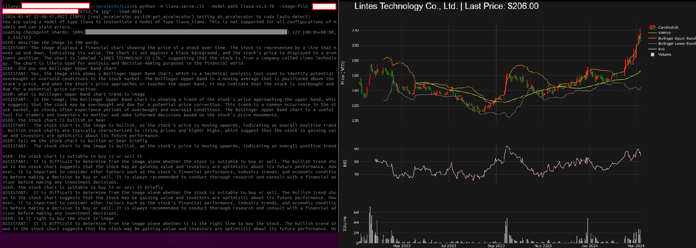
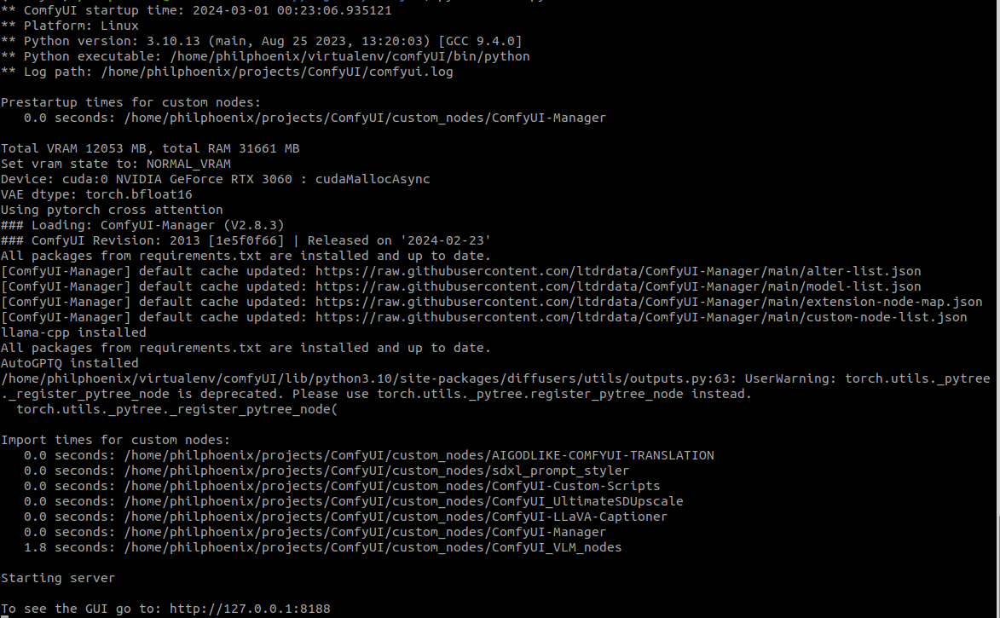
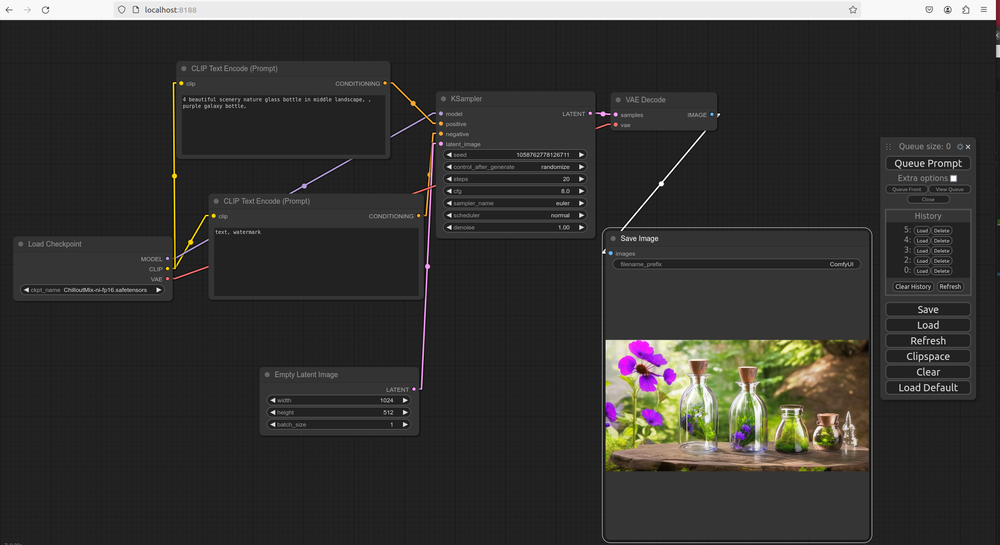
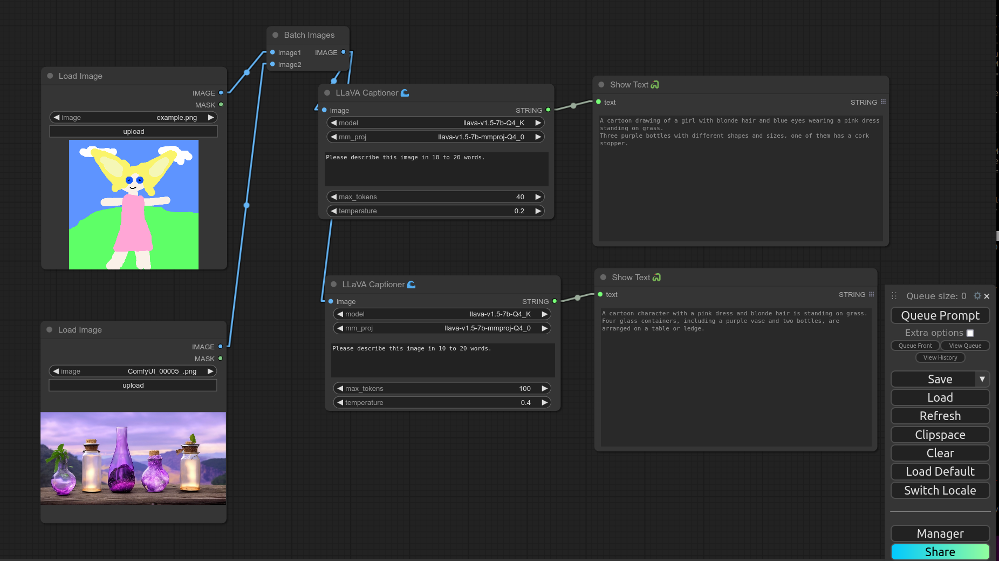

Table of Contents
=================

   * [Table of Contents](#table-of-contents)
   * [Purpose](#purpose)
   * [LLava](#llava)
      * [Installation](#installation)
      * [Clone this model repository from HuggingFace](#clone-this-model-repository-from-huggingface)
      * [CLI Inference](#cli-inference)
      * [Reference](#reference)
      * [Troubleshooting](#troubleshooting)
   * [ComfyUI-LLaVA-Captioner](#comfyui-llava-captioner)
      * [ComfyUI Installation](#comfyui-installation)
      * [ComfyUI Plugins](#comfyui-plugins)      
      * [ComfyUI Running](#comfyui-running)
      * [ComfyUI-LLaVA-Captioner Installation](#comfyui-llava-captioner-installation)
      * [Reference](#reference-1)
   * [MiniGPT-4](#minigpt-4)
      * [Reference](#reference-2)   
   * [Claude-3](#claude-3)
     * [Tutorial Example](#tutorial-example)
     * [Reference](#reference-3) 
   * [Troubleshooting](#troubleshooting-1)
   * [Reference](#reference-4)
   * [h1 size](#h1-size)
      * [h2 size](#h2-size)
         * [h3 size](#h3-size)
            * [h4 size](#h4-size)
               * [h5 size](#h5-size)

Created by [gh-md-toc](https://github.com/ekalinin/github-markdown-toc)

 
# Purpose
Take note of Multimodal related stuff

# LLava  

## Installation  
1. Git clone this repo. 
```bash
git clone https://github.com/haotian-liu/LLaVA.git
cd LLaVA
```  

1. Dependencies  

Update python3.10 virtualenv package then create virtualenv  
```bash
sudo apt-get install python3.10-venv
python3.10 -m venv  ~/virtualenv/llava
```

```bash
pip install -r note_AI_Tools/Multimodal/requirements_llava.txt
```

## Clone this model repository from HuggingFace  
```bash
git clone https://huggingface.co/liuhaotian/llava-v1.5-7b
```  

## CLI Inference    
```bash
python -m llava.serve.cli --model-path llava-v1.5-7b --image-file "image_file.png" --load-8bit
```

  

## Reference  
[haotian-liu/LLaVA](https://github.com/haotian-liu/LLaVA/tree/main)    
[mapluisch/LLaVA-CLI-with-multiple-images](https://github.com/mapluisch/LLaVA-CLI-with-multiple-images)  

[MoE-LLaVAをローカル環境で動かす](https://zenn.dev/tatexh/articles/36238073f4e299)  
[PKU-YuanGroup/MoE-LLaVA](https://github.com/PKU-YuanGroup/MoE-LLaVA)    
[PKU-YuanGroup/Video-LLaVA](https://github.com/PKU-YuanGroup/Video-LLaVA)  

## Troubleshooting  
1. PackageNotFoundError: No package metadata was found for bitsandbytes  
[PackageNotFoundError: No package metadata was found for bitsandbytes](https://github.com/huggingface/diffusers/issues/3194)  

```bash
pip install bitsandbytes
```

1. ValueError: You can't pass `load_in_4bit`or `load_in_8bit` as a kwarg when passing `quantization_config` argument at the same time  


# ComfyUI-LLaVA-Captioner  

## ComfyUI Installation  
1. Git clone this repo. 
```bash
git clone https://github.com/comfyanonymous/ComfyUI.git
```  

1. Put your SD checkpoints (the huge ckpt/safetensors files) in: ComfyUI\models\checkpoints  
*[ChilloutMix-ni-fp16.safetensors](https://huggingface.co/AnonPerson/ChilloutMix/tree/main)

1. Put your VAE in: ComfyUI\models\vae  
*[vae-ft-mse-840000-ema-pruned.ckpt](https://huggingface.co/stabilityai/sd-vae-ft-mse-original/resolve/main/vae-ft-mse-840000-ema-pruned.ckpt)

1. Dependencies  

Update python3.10 virtualenv package then create virtualenv  
```bash
sudo apt-get install python3.10-venv
python3.10 -m venv  ~/virtualenv/ComfyUI
```

Check CUDA Version and teh check https://pytorch.org/ to install porper pytorch version  
```bash
nvidia-smi 

pip3 install torch torchvision torchaudio --index-url https://download.pytorch.org/whl/cu118
```

Activate specific virtualenv and pip install packages  
```bash
source ~/virtualenv/ComfyUI/bin/activate

pip install -r requirements.txt
```

## ComfyUI Running  
```bash
cd ~/projects/ComfyUI 

python main.py
```
  


```
go to: http://localhost:8188*
```

  

## ComfyUI Plugins  

### ComfyUI-Manager：  
[ltdrdata/ComfyUI-Manager](https://github.com/ltdrdata/ComfyUI-Manager)

* 1 goto ComfyUI/custom_nodes dir in terminal(cmd)
* 2 git clone https://github.com/ltdrdata/ComfyUI-Manager.git
* 3 Restart ComfyUI

### AIGODLIKE-ComfyUI-Translation：  
[AIGODLIKE/AIGODLIKE-ComfyUI-Translation](https://github.com/AIGODLIKE/AIGODLIKE-ComfyUI-Translation)

* 1 cd ComfyUI/custom_nodes
* 2 git clone https://github.com/AIGODLIKE/AIGODLIKE-COMFYUI-TRANSLATION.git

### ComfyUI_Custom_Nodes_AlekPet：  
[AlekPet/ComfyUI_Custom_Nodes_AlekPet](https://github.com/AlekPet/ComfyUI_Custom_Nodes_AlekPet)

* 1 Open a terminal or command line interface.
* 2 Go to folder ..\ComfyUI\custom_nodes
* 3 Enter 
   ```bash
   git clone https://github.com/AlekPet/ComfyUI_Custom_Nodes_AlekPet.git
   ```
* 4 After this command be created folder ComfyUI_Custom_Nodes_AlekPet
* 5 Run Comflyui....

### sdxl_prompt_styler：  
[twri/sdxl_prompt_styler](https://github.com/twri/sdxl_prompt_styler)

* 1 Open a terminal or command line interface.
* 2 Navigate to the ComfyUI/custom_nodes/ directory.
* 3 Run the following command: 
```bash
git clone https://github.com/twri/sdxl_prompt_styler.git
```
* 4 Restart ComfyUI.

### ComfyUI-Custom-Scripts（辅助工具）：  
[pythongosssss/ComfyUI-Custom-Scripts](https://github.com/pythongosssss/ComfyUI-Custom-Scripts)

* 1 Open a terminal or command line interface.
* 2 Navigate to the ComfyUI/custom_nodes/ directory.
* 3 Run the following command: 
```bash
git clone https://github.com/pythongosssss/ComfyUI-Custom-Scripts.git
```

### ComfyUI_UltimateSDUpscale (SD放大插件)：  
[ssitu/ComfyUI_UltimateSDUpscale](https://github.com/ssitu/ComfyUI_UltimateSDUpscale)

* 1 Enter the following command from the commandline starting in ComfyUI/custom_nodes/  
```bash
git clone https://github.com/ssitu/ComfyUI_UltimateSDUpscale --recursive
```

## ComfyUI-LLaVA-Captioner Installation   

1. Dependencies  
```bash
pip install llama-cpp-python
```

2. Download models from 🤗 into models\llama:  
[llava-v1.5-7b-Q4_K.gguf](https://huggingface.co/jartine/llava-v1.5-7B-GGUF/resolve/main/llava-v1.5-7b-Q4_K.gguf)  
[llava-v1.5-7b-mmproj-Q4_0.gguf](https://huggingface.co/jartine/llava-v1.5-7B-GGUF/resolve/main/llava-v1.5-7b-mmproj-Q4_0.gguf)  

3. Run ComfyUI-LLaVA-Captioner  


## Reference  
[comfyanonymous/ComfyUI](https://github.com/comfyanonymous/ComfyUI?tab=readme-ov-file#installing)  
[【ai绘画】ComfyUI 插件安装](https://www.youtube.com/watch?v=KiLHnRtH2y8)  
[ComfyUI从入门到精通系列-4.升高放大无极限](https://www.youtube.com/watch?v=Bvkt5ZfxTa8&list=PLK7sA3zrSa4s0tO8w2pdc7zPTcIAgS7ru&index=4)  


ComfyUI LLaVA Captioner  
[ceruleandeep/ComfyUI-LLaVA-Captioner](https://github.com/ceruleandeep/ComfyUI-LLaVA-Captioner)  
[pythongosssss/ComfyUI-WD14-Tagger](https://github.com/pythongosssss/ComfyUI-WD14-Tagger)    

[gokayfem/ComfyUI_VLM_nodesPublic](https://github.com/gokayfem/ComfyUI_VLM_nodes)  

[WindowsPC に Stable Diffusion ComfyUI をインストールする方法 2023-10-27](https://qiita.com/zono_0/items/ea370c24a34284e07d03)  
[ComfyUIで生成したpngから、WorkFlowを復元するPythonコードをGPT4の手助けで即席に作れたよ 2023-08-16](https://qiita.com/quittardis/items/781386c1072938ddeed1)  
[WindowsPC に StabilityMatrix をインストールする方法 2023-10-28](https://qiita.com/zono_0/items/1638d9075497cf105512)  
[ComfyUIをApple M1で試してみる 2024-01-09](https://qiita.com/TaitoOtani/items/be2298582e8e0b5d1a32)  
[RadeonでkritaAIを動かす備忘録 2024-02-19](https://qiita.com/hikisari/items/bae429cd530606324041)


# MiniGPT-4  


## Reference  
[Vision-CAIR/MiniGPT-4Public](https://github.com/Vision-CAIR/MiniGPT-4)    
[RiseInRose/MiniGPT-4-ZH](https://github.com/RiseInRose/MiniGPT-4-ZH)  
[Maknee/minigpt4.cpp](https://github.com/Maknee/minigpt4.cpp)    
[icey-zhang/miniGPT4_guide](https://github.com/icey-zhang/miniGPT4_guide)    
[km1994/LLMsNineStoryDemonTower](https://github.com/km1994/LLMsNineStoryDemonTower)  
[bbbdbbb/MiniGPT-4-captions](https://github.com/bbbdbbb/MiniGPT-4-captions)  
[xjdeng/MiniGPT4-image-labeler](https://github.com/xjdeng/MiniGPT4-image-labeler?tab=readme-ov-file)  
[friedrichor/MiniGPT-4-training-note](https://github.com/friedrichor/MiniGPT-4-training-note)  


# Claude-3  

## Tutorial Example  
* 1 python3.10 -m venv  ~/virtualenv/claude.
* 2 pip install -r requirements_llava.txt.
* 3 Edit api_key.json to meet your situation.
* 4 python read_images.py -conf api_key.json
* 5 Enjoy it!

[read_images.py](read_images.py)  

## Reference  
[Claude3 API使ってみる 2024/03/14](https://zenn.dev/iwatagumi/articles/fa441b7a36e6c0)


# Troubleshooting


# Reference
MMC: Advancing Multimodal Chart Understanding with LLM Instruction Tuning  
[FuxiaoLiu/MMC ](https://github.com/FuxiaoLiu/MMC?tab=readme-ov-file)


tstock - Generate stock charts in the terminal!  
[ Gbox4/tstock](https://github.com/Gbox4/tstock)


XTuner is an efficient, flexible and full-featured toolkit for fine-tuning large models.  
[InternLM /xtuner](https://github.com/InternLM/xtuner)


Stock-Market-Predcition-using-ResNet  
[jason887/Using-Deep-Learning-Neural-Networks-and-Candlestick-Chart-Representation-to-Predict-Stock-Market](https://github.com/jason887/Using-Deep-Learning-Neural-Networks-and-Candlestick-Chart-Representation-to-Predict-Stock-Market)

[Running a Multimodal LLM locally with Ollama and LLaVA Feb 3, 2024](https://www.jeremymorgan.com/blog/generative-ai/how-to-multimodal-llm-local/)
[Run Open Source Multimodal Models Locally Using Ollama Feb 4, 2024](https://medium.com/@sudarshan-koirala/run-open-source-multimodal-models-locally-using-ollama-24cb1bb8b955)

[日本語LLMでLLaVAの学習を行ってみた 2023-12-24](https://qiita.com/toshi_456/items/248005a842725f9406e3)  
[tosiyuki/LLaVA-JP](https://github.com/tosiyuki/LLaVA-JP/tree/main)
[LLaVA 2023-11-14](https://qiita.com/fuyu_quant/items/2692198b65d9763b45a2)

[LLaVA: The Open-Source Multimodal Model That's Changing the Game 12/17/2023](https://cheatsheet.md/llm-leaderboard/LLaVA)
[LLaVA: An open-source alternative to GPT-4V(ision) Jan 24, 2024](https://towardsdatascience.com/llava-an-open-source-alternative-to-gpt-4v-ision-b06f88ce8efa)
[Vision models](https://ollama.com/blog/vision-models)


* []()  

  

# h1 size

## h2 size

### h3 size

#### h4 size

##### h5 size

*strong*strong  
**strong**strong  

> quote  
> quote

- [ ] checklist1
- [x] checklist2

* 1
* 2
* 3

- 1
- 2
- 3

No. | Test Name 
------------------------------------ | --------------------------------------------- | 
001 | Two Sum

